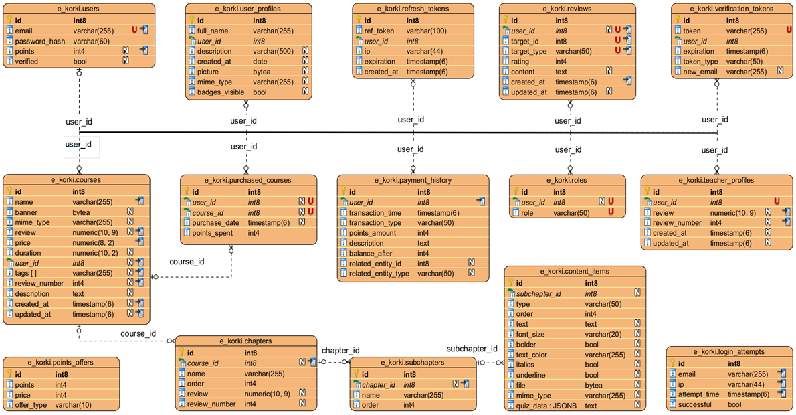
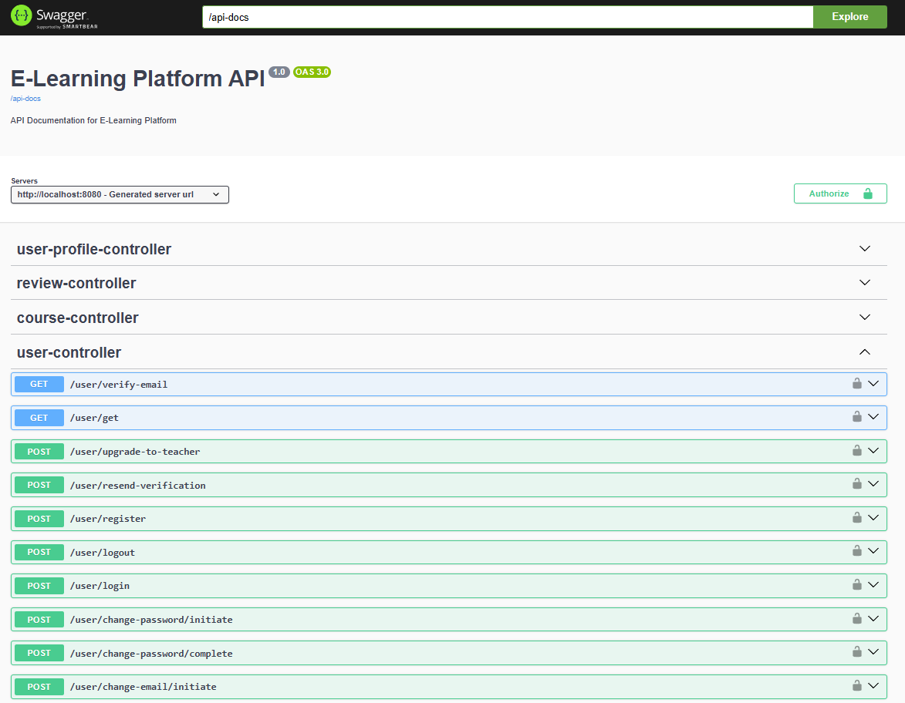
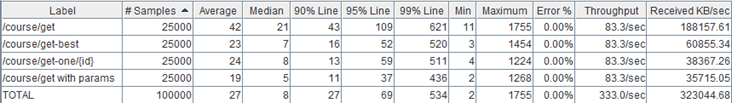

# 🎓 E-Learning Platform - Backend API


[](https://openjdk.org/)
[](https://spring.io/projects/spring-boot)
[](https://www.postgresql.org/)
[](https://opensource.org/licenses/MIT)
[](https://github.com/JakubPatkowski/KorepetycjeOnlineBackend/releases)
[](https://github.com/JakubPatkowski/KorepetycjeOnlineBackend/actions/workflows/build.yml)


Backend REST API for an e-learning platform that enables creating and selling online courses. This project was developed as an engineering thesis at Lublin University of Technology.

> **Frontend application:** [InzynierkaFrontend](https://github.com/Hiubertus/InzynierkaFrontend) (Angular)

---
## 📖 About


Frontend Main Page


Database ERD diagram


Swagger Documentation


Jmeter tests


The system enables:
- **User registration and verification** - with email confirmation
- **Course publishing** - with chapters, subchapters, and various content types (text, quiz, video, images)
- **Points system** - virtual currency for purchasing courses
- **Reviews and ratings** - rating courses and teachers
- **User roles** - permission hierarchy (User → Verified → Teacher → Admin)


---

## 🛠 Tech Stack

| Layer | Technology |
|-------|------------|
| Language | Java 22 |
| Framework | Spring Boot 3.3.2 |
| Security | Spring Security + JWT |
| Database | PostgreSQL 16 |
| ORM | Hibernate / Spring Data JPA |
| Cache | Caffeine |
| Build | Maven |
| API Docs | Swagger UI (SpringDoc OpenAPI) |

---

## 🚀 Quick Start (Docker)

### Prerequisites
- [Docker](https://www.docker.com/get-started) and Docker Compose

### Running the Application

```bash
# 1. Clone the repository
git clone https://github.com/JakubPatkowski/KorepetycjeOnlineBackend.git
cd KorepetycjeOnlineBackend

# 2. Start the application
docker compose up -d

# 3. Check status
docker compose ps
```

The application will be available at:
- **API:** http://localhost:8080
- **Swagger UI:** http://localhost:8080/swagger-ui/index.html

### Demo Accounts

The application automatically creates demo data on first run (non-production profile):

| Role | Email | Password |
|------|-------|----------|
| Admin | `admin@example.com` | `TestTest123!@#` |
| Teacher | `teacher1@example.com` | `TestTest123!@#` |
| Verified User | `verified1@example.com` | `TestTest123!@#` |
| Regular User | `user@example.com` | `TestTest123!@#` |

> **Note:** 5 teachers (`teacher1-5@example.com`) and 50 verified users (`verified1-50@example.com`) are created with sample courses, reviews, and purchases.

### Stopping

```bash
docker compose down        # stop containers
docker compose down -v     # stop and remove data (including database)
```

---

## ⚙️ Configuration

### Environment Variables (Docker)

The `docker-compose.yml` configures the application through environment variables:

| Variable | Description | Default |
|----------|-------------|---------|
| `SPRING_DATASOURCE_URL` | Database connection URL | `jdbc:postgresql://postgres:5432/korki_online` |
| `SPRING_DATASOURCE_USERNAME` | Database username | `postgres` |
| `SPRING_DATASOURCE_PASSWORD` | Database password | `postgres123` |
| `JWT_ACCESSTOKENEXPIRATION` | Access token lifetime (ms) | `86400000` (24h) |
| `JWT_REFRESHTOKENEXPIRATION` | Refresh token lifetime (ms) | `604800000` (7 days) |

### Local Development (without Docker)

1. **Create PostgreSQL database:**
```sql
CREATE DATABASE korki_online;
```

2. **Run the schema script:**
```bash
psql -U postgres -d korki_online -f src/main/resources/schema.sql
```

3. **Configure `application.properties`:**
```properties
# Database
spring.datasource.url=jdbc:postgresql://localhost:5432/korki_online
spring.datasource.username=postgres
spring.datasource.password=your_password
spring.jpa.properties.hibernate.default_schema=e_korki

# JWT
jwt.accessTokenExpiration=86400000
jwt.refreshTokenExpiration=604800000

# Email (optional - required for account verification)
spring.mail.host=smtp.gmail.com
spring.mail.port=587
spring.mail.username=your_email@gmail.com
spring.mail.password=your_app_password
```

4. **Run the application:**
```bash
./mvnw spring-boot:run
```

### Important Configuration Notes

- **Schema:** The application uses PostgreSQL schema `e_korki`. This is configured in `application.properties` via `spring.jpa.properties.hibernate.default_schema`
- **Preview Features:** Java 22 String Templates are used - the `pom.xml` includes `--enable-preview` compiler flag
- **Demo Data:** `DataInitializer` runs automatically on non-production profiles and populates the database with sample users, courses, and reviews
- **Logging:** Logs are written to `logs/` directory (configured in `logback-spring.xml`)

---

## 🏗 Architecture

```
┌─────────────────────────────────────────────────────────────┐
│                        CLIENT                               │
│                  (Angular Frontend)                         │
└──────────────────────────┬──────────────────────────────────┘
                           │ HTTP/REST
                           ▼
┌─────────────────────────────────────────────────────────────┐
│                    SPRING BOOT API                          │
├─────────────────────────────────────────────────────────────┤
│  ┌─────────────┐  ┌─────────────┐  ┌─────────────┐          │
│  │ Controllers │  │  Security   │  │   Config    │          │
│  │             │  │ JWT Filter  │  │   Beans     │          │
│  └──────┬──────┘  └──────┬──────┘  └─────────────┘          │
│         │                │                                  │
│         ▼                ▼                                  │
│  ┌─────────────────────────────────────────────────┐        │
│  │              SERVICE LAYER                      │        │
│  │  UserService, CourseService, ReviewService...   │        │
│  └───────────────────────┬─────────────────────────┘        │
│                          │                                  │
│         ┌────────────────┼────────────────┐                 │
│         ▼                ▼                ▼                 │
│  ┌────────────┐     ┌───────────┐   ┌───────────┐           │
│  │   JPA      │     │ Caffeine  │   │   SMTP    │           │
│  │Repositories│     │   Cache   │   │  (Email)  │           │
│  └────────────┘     └───────────┘   └───────────┘           │
└───────────────────────────┼─────────────────────────────────┘
                            │
                            ▼
                   ┌─────────────────┐
                   │   PostgreSQL    │
                   │   (e_korki)     │
                   └─────────────────┘
```

---

## 🔐 Security

- **JWT Authentication** - Access Token (24h) + Refresh Token (7 days)
- **Password encryption** - BCrypt (strength 10)
- **Brute-force protection** - failed login attempt tracking
- **Email verification** - activation tokens
- **Role hierarchy** - `ADMIN > TEACHER > VERIFIED > USER`

---

## 📚 API Endpoints

| Endpoint | Description | Auth Required |
|----------|-------------|---------------|
| `POST /user/register` | User registration | No |
| `POST /user/login` | Login (returns JWT) | No |
| `GET /course/get` | List all courses | No |
| `GET /course/get-one/{id}` | Get course details | No |
| `POST /course/create` | Create new course | Yes (Teacher) |
| `POST /course/buy` | Purchase a course | Yes |
| `POST /review/add/course/{id}` | Add course review | Yes |
| `GET /points/get-offers` | Get points packages | No |

Full API documentation available at **Swagger UI** after starting the application.

---

## 📁 Project Structure

```
src/main/java/com/example/ekorki/
├── configuration/   # Spring, Security, Cache, DataInitializer
├── controller/      # REST Controllers
├── dto/             # Data Transfer Objects
├── entity/          # JPA Entities
├── repository/      # Spring Data Repositories
├── service/         # Business logic
├── filter/          # JWT Filter
└── exception/       # Exception handling
```

---

## 🧪 Testing the API

After starting, test the API with demo credentials:

```bash
# 1. Login to get JWT token
curl -X POST http://localhost:8080/user/login \
  -H "Content-Type: application/json" \
  -d '{"email":"admin@example.com","password":"TestTest123!@#"}'

# 2. Use the returned accessToken for authenticated requests
curl http://localhost:8080/user/get \
  -H "Authorization: Bearer YOUR_ACCESS_TOKEN"
```

Or use **Swagger UI**: http://localhost:8080/swagger-ui/index.html
1. Click "Authorize" button
2. Enter: `Bearer YOUR_ACCESS_TOKEN`

---

## 📝 Notes

This is an engineering thesis project - it is not intended for production use. It demonstrates skills in:
- REST API design
- Security implementation (JWT, roles, hierarchy)
- Database operations (JPA/Hibernate, PostgreSQL)
- Caching and optimization (Caffeine)
- Docker containerization

---

## 👥 Authors

**Backend:** [Jakub Patkowski](https://github.com/JakubPatkowski)

**Frontend:** [Hubert Ozarowski](https://github.com/Hiubertus) - [See frontend repository](https://github.com/Hiubertus/InzynierkaFrontend)

---

## 📄 License

MIT License - see [LICENSE](LICENSE) file for details